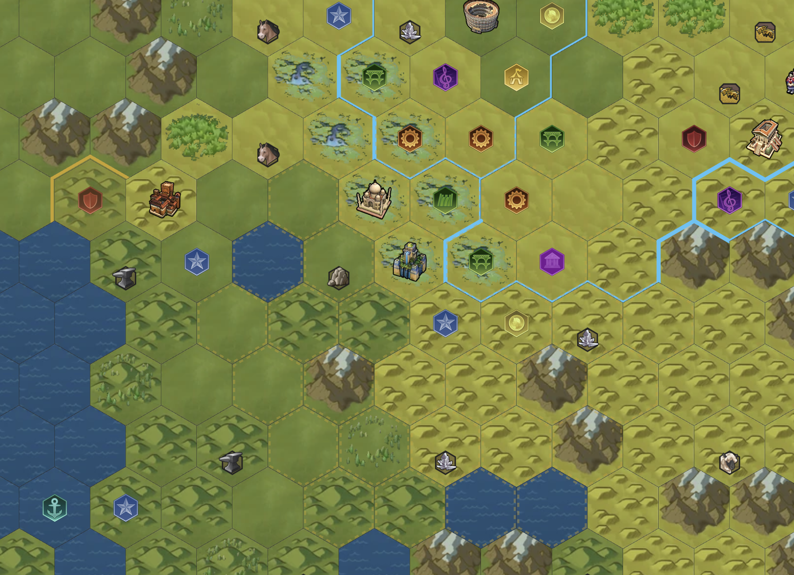

# Civ6 District Simulator

A comprehensive Civilization 6 district adjacency calculator with a 2.5D hex map editor.



## Features

- **🗺️ Interactive Hex Map**: 2.5D isometric view of a hex grid with zoom and pan controls
- **🏛️ District Placement**: Place and manage Civ6 districts with accurate adjacency bonus calculations
- **📊 Adjacency Calculator**: Real-time calculation of all district adjacency bonuses
- **🎨 Tile Editor**: Full terrain, feature, resource, and district editing
- **💾 Save/Load**: Export and import maps as JSON files
- **⌨️ CLI Support**: Run adjacency calculations from the command line

## Getting Started

### Prerequisites

- Node.js 18+ 
- npm or yarn

### Installation

```bash
# Install dependencies
npm install

# Start development server
npm run dev

# Build for production
npm run build
```

### CLI Usage

The simulator includes a CLI for running adjacency calculations without the UI:

```bash
# Run the CLI
npm run cli

# Or directly with tsx
npx tsx src/cli/index.ts
```

#### CLI Commands

```
Map Management:
  new <width> <height>     Create new map (default: 10x10)
  load <filename>          Load map from JSON file
  save <filename>          Save map to JSON file
  show map                 Display ASCII map

City & Tiles:
  city <q> <r>             Set city center location
  tile <q> <r>             Show tile info
  tile set <q> <r> <type>  Set terrain (e.g., plains_hills)

Districts:
  district <q> <r> <type>  Place district
  district list            List all district types
  district remove <q> <r>  Remove district from tile

Adjacency Calculation:
  calc                     Calculate all adjacency bonuses
  suggest <district>       Find best placement for district

Other:
  demo                     Load demo map with sample setup
  list terrains|features   List available types
  help                     Show help
  quit                     Exit
```

## Architecture

### Core Module (`src/core/`)

- **`types.ts`**: TypeScript types and enums for all Civ6 game elements
- **`Tile.ts`**: Tile class representing a single hex on the map
- **`GameMap.ts`**: Map class managing the hex grid and utilities
- **`AdjacencyEngine.ts`**: Adjacency bonus calculation engine
- **`gameData.ts`**: Civ6 game data (terrains, districts, wonders, etc.)

### UI Module (`src/ui/`)

- **`App.tsx`**: Main application component
- **`components/HexMap.tsx`**: 2.5D hex map renderer
- **`components/TileEditor.tsx`**: Tile property editor panel
- **`components/AdjacencyPanel.tsx`**: Adjacency results display
- **`components/Toolbar.tsx`**: Map controls toolbar
- **`hooks/useMapState.ts`**: React hook for map state management

### CLI Module (`src/cli/`)

- **`index.ts`**: Command-line interface

## Adjacency Bonus Rules

The simulator implements Civ6 adjacency rules for specialty districts:

### Campus (+Science)
- +1 per adjacent Mountain
- +1 per 2 adjacent Rainforest tiles
- +1 per 2 adjacent District tiles
- +2 per adjacent Geothermal Fissure or Reef

### Holy Site (+Faith)
- +1 per adjacent Mountain
- +1 per 2 adjacent Woods tiles
- +1 per 2 adjacent District tiles
- +2 per adjacent Natural Wonder

### Theater Square (+Culture)
- +2 per adjacent Wonder
- +1 per 2 adjacent District tiles

### Commercial Hub (+Gold)
- +2 for adjacent River
- +2 per adjacent Harbor
- +1 per 2 adjacent District tiles

### Harbor (+Gold)
- +1 per adjacent coastal resource
- +2 per adjacent City Center
- +1 per 2 adjacent District tiles

### Industrial Zone (+Production)
- +1 per adjacent Mine or Quarry
- +2 per adjacent Aqueduct, Dam, or Canal
- +1 per 2 adjacent District tiles
- +1 per adjacent Strategic resource

### Government Plaza
- +1 to primary yield of all adjacent specialty districts

## Map File Format

Maps are saved as JSON with the following structure:

```json
{
  "version": 1,
  "name": "My Map",
  "width": 12,
  "height": 10,
  "tiles": [
    {
      "coord": { "q": 0, "r": 0 },
      "terrain": "grass",
      "modifier": "flat",
      "feature": "none",
      "resource": "none",
      "district": "none",
      "wonder": "none",
      "naturalWonder": "none",
      "improvement": "none",
      "riverEdges": [],
      "ownerCityId": null,
      "isCityCenter": false
    }
  ]
}
```

## Technology Stack

- **TypeScript**: Type-safe JavaScript
- **React 18**: UI framework
- **Vite**: Build tool and dev server
- **Tailwind CSS**: Utility-first CSS framework
- **SVG**: Hex map rendering

## Contributing

Contributions are welcome! Please feel free to submit a Pull Request.

## License

The **source code** in this repository is licensed under the MIT License — see [LICENSE](LICENSE) for details.

### Third-Party Assets (Not Covered by MIT)

The icons in `public/icons/` are property of **Firaxis Games** and **2K Games** (Civilization VI). These assets are **NOT** covered by the MIT license and are included here for non-commercial, educational, and fan project purposes only. They remain the intellectual property of their respective owners.

- Game data and icons sourced from the [Civilization VI Wiki](https://civilization.fandom.com/):
  - [District Icons](https://civilization.fandom.com/wiki/Category:District_icons_(Civ6))
  - [Terrain Icons](https://civilization.fandom.com/wiki/Category:Terrain_icons_(Civ6))
  - [Resource Icons](https://civilization.fandom.com/wiki/Category:Resource_icons_(Civ6))
  - [Yield Icons](https://civilization.fandom.com/wiki/Category:Yield_icons_(Civ6))

If you are a copyright holder and have concerns about the use of these assets, please open an issue.

## Acknowledgments

- Civilization VI and all related game content © Firaxis Games / 2K Games
- This is an unofficial fan project and is not affiliated with or endorsed by Firaxis or 2K

